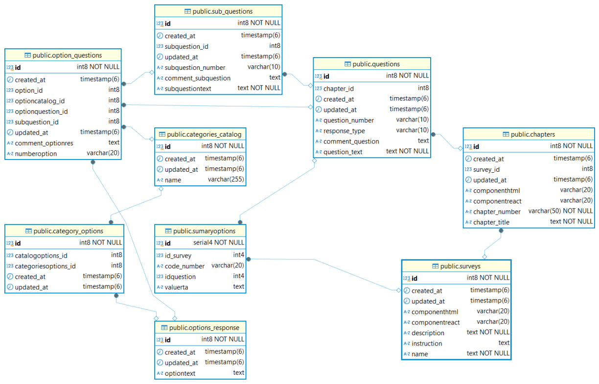

# 📊 Sistema de Encuestas

Este proyecto es una **API REST** desarrollada con **.NET 9.0** que permite la creación, gestión y almacenamiento de encuestas de forma **modular**, **escalable** y **mantenible**. Sigue los principios de **Clean Architecture**, asegurando una separación clara de responsabilidades y facilitando futuras ampliaciones.

El sistema está diseñado para manejar encuestas complejas con una estructura jerárquica que incluye capítulos, preguntas y subpreguntas. Permite la creación de diferentes tipos de respuestas, categorización de opciones y generación de resúmenes para análisis de datos. La arquitectura implementada garantiza un código limpio, testeable y fácil de mantener, siguiendo las mejores prácticas de desarrollo en .NET.

Características destacadas:
- 🏗️ Arquitectura limpia y modular
- 🔄 Soporte para múltiples bases de datos
- 📱 API RESTful documentada con Swagger
- 🛡️ Implementación de patrones de diseño
- 📊 Sistema de análisis y resúmenes
- 🔍 Gestión avanzada de encuestas

---

## 🧱 Estructura del Proyecto

El sistema se organiza en capas siguiendo la arquitectura limpia:

### 🔹 `Domain`
Define las **entidades** y las **reglas de negocio**:

- `Survey`: Encuesta principal.
- `Chapter`: Capítulos/secciones de la encuesta.
- `Question`: Preguntas por capítulo.
- `SubQuestion`: Subpreguntas relacionadas con una pregunta.
- `OptionQuestion`: Opciones de respuesta para preguntas.
- `SumaryOption`: Opciones de resumen para análisis.
- `CategoryCatalog`: Catálogo de categorías.
- `CategoryOption`: Opciones específicas por categoría.
- `OptionResponse`: Registro de respuestas seleccionadas.

> 📌 Representación visual de la relación entre entidades:



---

### 🔹 `Application`
Contiene:
- Casos de uso y lógica de negocio.
- Interfaces para servicios externos y persistencia.
- Servicios de aplicación que orquestan la lógica del dominio.

---

### 🔹 `Infrastructure`
Incluye:
- Configuración de **Entity Framework Core**.
- Implementaciones concretas para acceso a datos.
- Soporte para múltiples bases de datos relacionales.

---

### 🔹 `ApiPublic`
Exposición de la API RESTful:
- Controladores.
- Inyección de dependencias.
- Configuración de Swagger y middlewares.
- Configuración de CORS y seguridad básica.

---

## 🛠️ Tecnologías Utilizadas

- **Lenguaje:** C# (.NET 9.0)
- **ORM:** Entity Framework Core (Code First)
- **Bases de Datos Soportadas:**
  - MySQL (Pomelo.EntityFrameworkCore.MySql)
  - PostgreSQL (Npgsql.EntityFrameworkCore.PostgreSQL)
  - SQL Server (Microsoft.EntityFrameworkCore.SqlServer)
- **Documentación de API:** OpenAPI/Swagger
- **Control de Versiones:** Git

---

## ⚙️ Configuración y Puesta en Marcha

1. **Clona el repositorio:**
   ```bash
   git clone https://github.com/juancarlosfc5/Public.git
   cd Public
   ```

2. **Configura las cadenas de conexión** en `appsettings.Development.json`:
   ```json
   {
     "ConnectionStrings": {
       "ConexMySql": "server=localhost;user=root;password=1234;database=public;AllowPublicKeyRetrieval=True;SslMode=Preferred;",
       "ConexSqlServer": "Data Source=localhost\\sqlexpress;Initial Catalog=DB;Integrated Security=True",
       "DefaultConnection": "Host=localhost;Port=5432;Database=public;Username=postgres;Password=1234;Pooling=true;"
     }
   }
   ```

3. **Restaura las dependencias:**
   ```bash
   dotnet restore
   ```

4. **Aplica las migraciones:**
   ```bash
   dotnet ef database update -p Infrastructure -s ApiPublic
   ```

5. **Inicia la aplicación:**
   ```bash
   dotnet run --project ApiPublic
   ```

## 🚀 Características Principales

- 📁 Arquitectura modular basada en Clean Architecture.
- 🧩 Gestión avanzada de encuestas con capítulos, preguntas y subpreguntas.
- 🧠 Análisis de datos mediante opciones de resumen y categorías.
- 🔄 Soporte para múltiples motores de base de datos.
- 🌐 API RESTful documentada con Swagger.
- ♻️ Fácilmente extensible y mantenible.

## ✅ Buenas Prácticas de Desarrollo

- Separación de responsabilidades clara entre capas.
- Uso de patrones como Repository, Service e Inyección de Dependencias.
- Migraciones automáticas mediante EF Core.
- Código preparado para testing y reutilización.

## 🗂️ Recursos Útiles

- Documentación Oficial de EF Core
- Clean Architecture - Jason Taylor
- OpenAPI Specification

## 📄 Licencia

Consulta el archivo LICENSE para más detalles.

## 📬 Contacto

- Desarrollado por Juan Carlos Florez
- GitHub: @juancarlosfc5